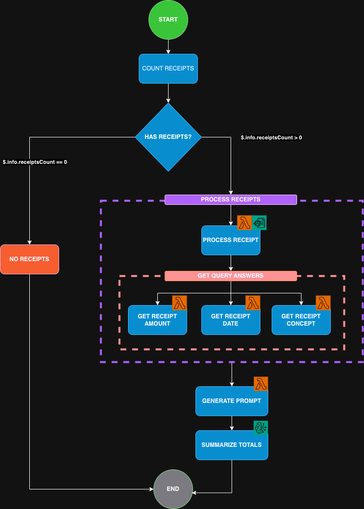

# DEMO: Receipt calculator

Given certain receipts of banks transactions.

Once transaction receipt files are uploaded to a S3 bucket trigger a StepFunctions
that invokes a lambda function that uses AWS Textract to extract the amount and date of each receipt
using a Map state, then, uses a Pass state to transform the response into a json object with format:

[
  {
    "amount": string,
    "date": string
  },
  ...
]



and then invoke AWS Bedrock to request a summarized response of total amounts paid
by month, and by year.

## How to run this project

This projects uses [AWS CDK](https://docs.aws.amazon.com/cdk/v2/guide/home.html) to deploy a CloudFormation stack with a state machine.

### 1. Install dependencies

```bash
# pnpm
pnpm install

# npm
npm install

# yarn
yarn install
```

### 2. Synthethize CDK Template

```bash
# pnpm
pnpm run cdk:synt

# npm
npm run cdk:synt

# yarn
yarn run cdk:synt
```

### 3. Deploy CDK Stack

```bash
# pnpm
pnpm run cdk:deploy

# npm
npm run cdk:deploy

# yarn
yarn run cdk:deploy
```

### Specifying a different environment

By detault the `cdk:deploy` script will deploy to `dev` environment. If you want to deploy to a different environment, you can specify it using the `ENV_NAME` environment variable.

Valid environments values are:
`dev`, `qa`, `stage` or `prod`

#### Example: Deploying to QA
```bash
# pnpm
ENV_NAME=qa pnpm run cdk:deploy

# npm
ENV_NAME=qa  npm run cdk:deploy

# yarn
ENV_NAME=qa  yarn run cdk:deploy
```