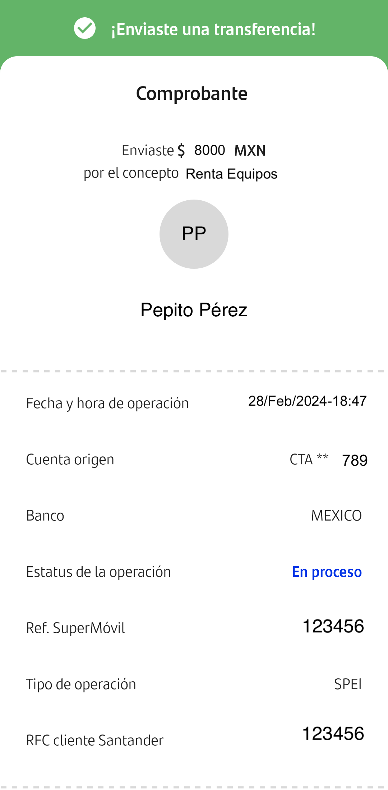
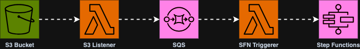

# DEMO: Receipts Total Calculator

## Application Description

We are creating a state machine with the AWS Step Functions service to process payment receipts from our bank and summarize the total expenses grouped by date with some help from ML (Machine Learning) and AI (Artificial Intelligence).

The process will begin once one or more payment receipts are uploaded in a S3 Bucket, this action will trigger a Lambda Function that sends messages to a SQS queue for them to be processed later.

This is an example of the expected receipt images:



Another Lambda Function is subscribed to the SQS queue and will receive the batch of messages when there are receipts to process, starting the execution of the state machine.

This is a brief diagram of the architecture described:



First thing our state machine does is count the number of receipts to process, this is in order to be able to validate whether it wasn't triggered without any receipt pending for processing, in such case it will just fail and end the execution.

After validation the number of receipts. It starts a Map step to process each receipt.

For each receipt it will perform the following steps:

1. Invoke a Lambda Function that uses the AWS Textract service, which uses ML to retrieve information from images.
We will query for the `amount`, `date`, and `concept` of the payment.

2. It then invokes three steps in parallel to extract each query response, each of these invoke the same Lambda Function, but with a different parameter that indicates which query response to retrieve.

3. Using the extracted information of all the receipts, the next step generates a prompt that will be passed to an AI model with the AWS Bedrock service. This might look overkill but the point of this example is illustrate how easy is to integrate AWS Step Functions with other services, even more those that are included in the [optimized integrations](https://docs.aws.amazon.com/step-functions/latest/dg/connect-supported-services.html) services.

4. Last step calls the AI model along with the prompt from previous step and returns the summarize of expenses grouped by date.

[](./assets/state-machine-diagram.png)

If you would like to see how it looks like in the ASL (Amazon States Language), open the file at [./asl/receipt-processor-complete-asl.yaml](./asl/receipt-processor-complete-asl.yaml).

## How to deploy this project?

This projects uses [AWS CDK](https://docs.aws.amazon.com/cdk/v2/guide/home.html) to deploy a CloudFormation stack with a state machine.

### 1. Install dependencies

```bash
# pnpm
pnpm install

# npm
npm install

# yarn
yarn install
```

### 2. Synthethize CDK Template

```bash
# pnpm
pnpm run cdk:synth

# npm
npm run cdk:synth

# yarn
yarn run cdk:synth
```

### 3. Deploy CDK Stack

```bash
# pnpm
pnpm run cdk:deploy

# npm
npm run cdk:deploy

# yarn
yarn run cdk:deploy
```

### Specifying a different environment

By detault the `cdk:deploy` script will deploy to `dev` environment. If you want to deploy to a different environment, you can specify it using the `ENV_NAME` environment variable.

Valid environments values are:
`dev`, `qa`, `stage` or `prod`

#### Example: Deploying to QA
```bash
# pnpm
ENV_NAME=qa pnpm run cdk:deploy

# npm
ENV_NAME=qa  npm run cdk:deploy

# yarn
ENV_NAME=qa  yarn run cdk:deploy
```

## How to run this project?

After [deploying](#how-to-deploy-this-project) you can grab the example receipts images provided in the assets folder of this same repository and upload them to the S3 bucket generated.

That will trigger a coreography between the S3 bucket, a lambda function and a SQS queue, that will trigger the Step Functions state machine orchestrator, which is the main topic of this project.

### How to manually trigger the State Machine

You can also manually trigger the state machine, mimicking what the S3 bucket, lambda and SQS queue do in conjuntion, by simply provide the expected payload as the initial state of the Step Functions state machine.

The payload should follow the shape defined in the following Typescript type alias:

```typescript
type SateMachinePayload = {
  receipts: Array<{
    bucketName: string;
    key: string;
  }>;
}
```

Where the `key` property is the receipt file path within the bucket given in `bucketName`.

Example:
```json
{
  "receipts": [
    {
      "bucketName": "myReceiptBucket",
      "key": "recibo-1.png"
    },
    {
      "bucketName": "myReceiptBucket",
      "key": "recibo-2.png"
    },
    {
      "bucketName": "myReceiptBucket",
      "key": "recibo-3.png"
    }
  ]
}
```

Remember you can initialize an execution of a Step Functions state machine via the AWS Console, AWS CLI and/or AWS SDK.

## Who is this content for?

This example is provided by Luis Carlos Osorio Jayk for demoing different steps and integrations possible with the AWS Step Functions service in a workshop about Serverless Orchestration.
